# Лабораторная работа №10. Копия YouTube (Flexbox + Grid)

**ФИО:** Стренин Денис Олегович  
**Группа:** ИСП-231  
**Дата:** 1 марта 2026 года  

## 📋 Описание работы

В данной лабораторной работе создана копия интерфейса YouTube с использованием Flexbox и CSS Grid.

### Что изучено:
- ✅ Flexbox для создания шапки сайта
- ✅ Flexbox для боковой панели
- ✅ CSS Grid для сетки видео
- ✅ Медиа-запросы для адаптивности
- ✅ Стилизация элементов (кнопки, поиск, карточки)

## 📁 Структура проекта
Lab10_YouTube_Strenin/
├── README.md # Описание лабораторной работы
├── index.html # Главная страница
├── style.css # Стили
└── img/ # Папка со скриншотами
├── step1_basic_Strenin.png
├── step2_reset_Strenin.png
├── step3_header_html_Strenin.png
├── step4_header_flexbox_Strenin.png
├── step5_styled_buttons_Strenin.png
├── step6_search_Strenin.png
├── step7_sidebar_html_Strenin.png
├── step8_layout_Strenin.png
├── step9_video_grid_Strenin.png
├── step10_desktop_Strenin.png
├── step10_mobile_Strenin.png
├── brd.png
├── brd2.png
├── cyberpunk2077.png
├── komarov.png
├── ostrov_sokrovishch.png
└── wolf.png

## 🎨 Использованные технологии

### Flexbox применен для:
- Шапки сайта (header)
- Боковой панели (sidebar)
- Карточки видео (video-info)

### CSS Grid применен для:
- Сетки видео (video-grid)

## 📱 Адаптивность

- **Десктоп (≥ 1024px):** полная версия с боковой панелью
- **Планшет (768px - 1024px):** адаптированная сетка
- **Мобильные (≤ 768px):** скрыта боковая панель, одна колонка видео

## 🖼️ Скриншоты

### Шаг 1: Базовая структура
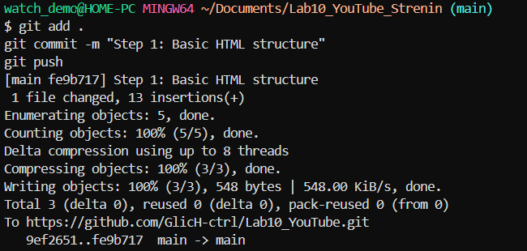

### Шаг 4: Header с Flexbox
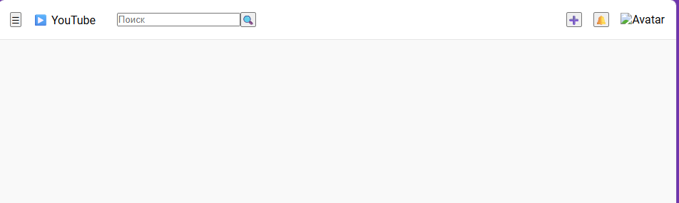

### Шаг 6: Стилизованный поиск
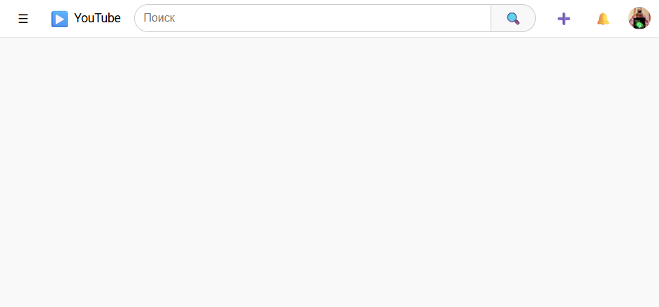

### Шаг 8: Готовый макет с sidebar
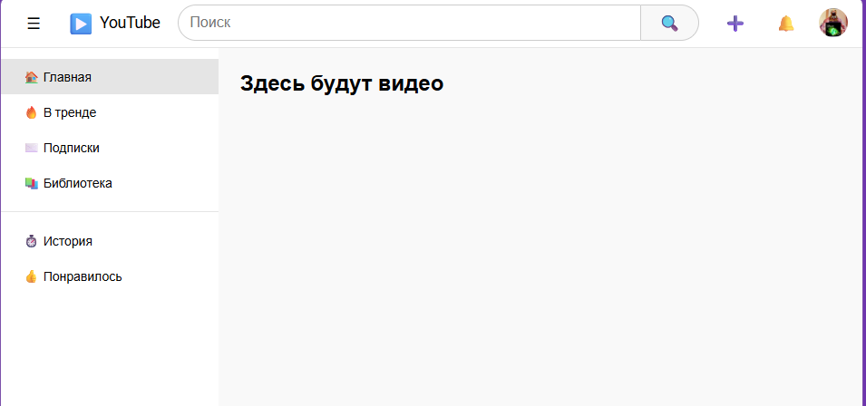

### Шаг 9: Сетка видео
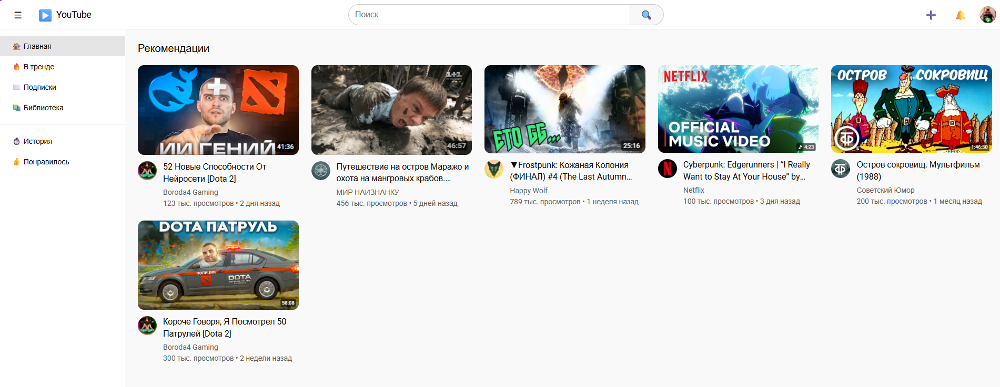

### Десктоп версия
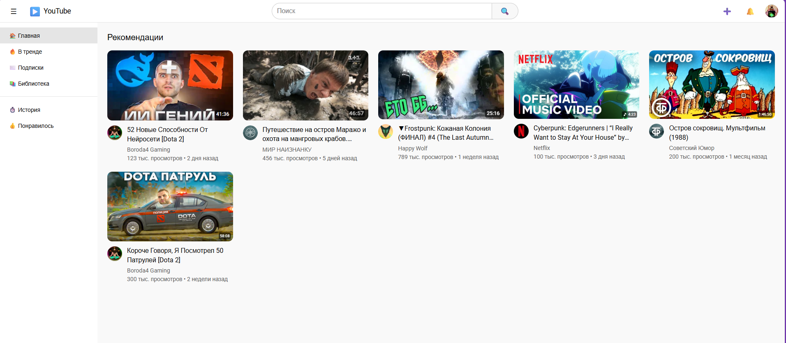

### Мобильная версия
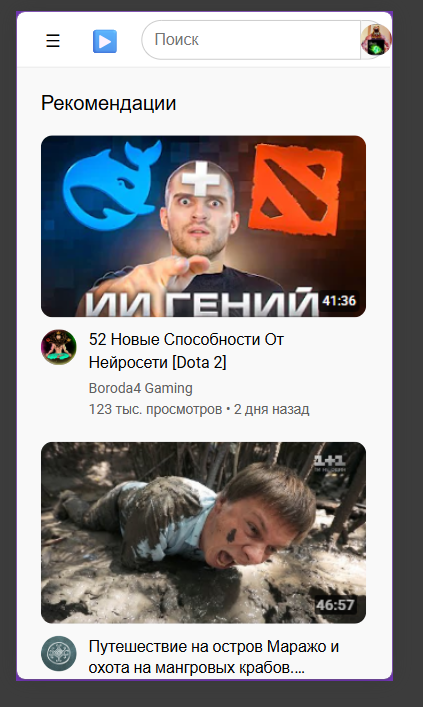

### Превью видео

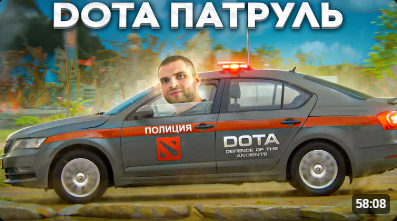
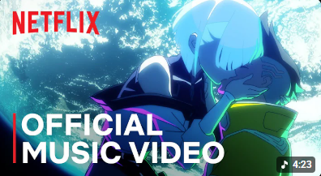
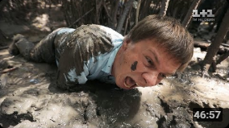
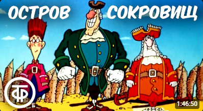
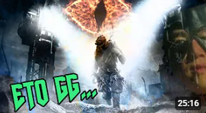

## 🔗 Ссылка на репозиторий

[https://github.com/GlicH-ctrl/Lab10_YouTube](https://github.com/GlicH-ctrl/Lab10_YouTube)

## ✅ Заключение

В ходе выполнения лабораторной работы:
- ✅ Создана полноценная копия интерфейса YouTube
- ✅ Применены Flexbox и Grid для построения макета
- ✅ Реализована адаптивность под все устройства
- ✅ Стилизованы все элементы интерфейса
- ✅ Выполнены все шаги и сделаны скриншоты
- ✅ Все изменения закоммичены и отправлены в GitHub